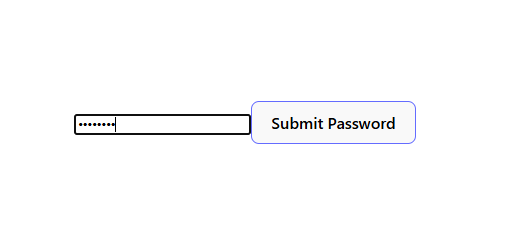

# Password Tracker React App

## Overview

This project is a simple React application that demonstrates how to use event handling in React components.

The application includes:

- A password input field that detects when the user types
- A submit button that detects mouse movement events

The goal of the project is to practice:

- Creating React components
- Handling events in React
- Using event handler functions
- Logging user interactions to the console

---

# Features

## PasswordInput Component

The `PasswordInput` component:

- Renders an `<input>` element
- Uses `type="password"` to hide entered text
- Tracks user typing with the `onChange` event
- Prints a message to the console when the password changes

Console output:

```bash
Entering password...
```

---

## SubmitButton Component

The `SubmitButton` component:

- Renders a `<button>`
- Detects when the mouse enters the button area
- Detects when the mouse leaves the button area
- Prints messages to the console for both events

Console outputs:

```bash
Mouse Entering
Mouse Exiting
```

---

# Technologies Used

- React
- JavaScript
- JSX

---

# Project Structure

```bash
src/
│
├── App.js
├── PasswordInput.js
└── SubmitButton.js
```

---

## Screenshot



# How to Run the Project

## 1. Install dependencies

```bash
npm install
```

## 2. Start the development server

```bash
npm start
```

## 3. Open the application

Visit:

```bash
http://localhost:3000
```

---

# Learning Objectives

By completing this lab, you will learn how to:

- Create reusable React components
- Use event listeners in React
- Handle form input events
- Handle mouse events
- Connect event handlers to JSX elements
- Use `console.log()` for debugging and testing

---

# Example Code Behavior

## Typing in the password field

When the user types:

```bash
Entering password...
```

appears in the browser console.

## Hovering over the button

When the mouse enters the button:

```bash
Mouse Entering
```

When the mouse leaves the button:

```bash
Mouse Exiting
```

---

# Author

Created by Matthew Swanberg as part of a React event handling lab exercise (course 4 mod 4).